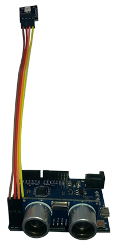

# Ultrasonic Parking Assistant



We saw a version of this project in [The Shed Magazine](http://www.theshedmag.co.nz/online/) , and thought it would be perfect to build using our duinotech parts. It simply uses an ultrasonic distance sensor to measure how far away the car is from the sensor, and then light up an RGB LED module to let you know how close you are. A simple job perfectly suited to an Arduino.

## Shopping List:

Note this project will happily work with either the Uno or Leonardo main boards, so you only need one or the other, not both. The only difference is that you might have to leave the RGB LED module disconnected until the board is programmed on the Uno, as it uses the serial communication pins.

|Qty| Code | Description |
|---|---|---|
|1 | [XC4430](http://jaycar.com.au/p/XC4430) | Leonardo Main Board
|1 | [XC4442](http://jaycar.com.au/p/XC4442) | Ultrasonic Sensor Module
|1 | [XC4428](http://jaycar.com.au/p/XC4428) | RGB LED Module
|1 | [WC6028](http://jaycar.com.au/p/WC6028) | Plug-socket jumper leads

## Connections:

This project is designed with simplicity in mind- the modules simply plug straight into the headers on the main board. The jumpers are used to extend the LED module to a point where you can see it. Our version of the wiring is as follows:

|Main Board|Ultrasonic|RGB LED|Function
|---|---|---|---
|D0|B||Blue LED
|D1|R||Red LED
|D2|G||Green LED
|D3|+||LED common
|D10||VCC|Power
|D11||TRIG|Trigger signal from Arduino
|D12||ECHO|Echo signal from ultrasonic
|D13||GND|Ground connection
If you have the version of the RGB LED with the BRG- markings instead of BRG+, connect – to D3 instead, and then you'll have to make a small change to the code before the sketch is uploaded. All the pins can be set in the sketch, so if these pins don't suit, they can be changed. If you're not sure, just go with what's listed above, as it's the default in the sketch.

The ultrasonic sensor simply pushes straight into pins 10-13. If you like, the pins can be gently bent back and straightened if you'd like to mount the main board against the wall. The RGB LED module is connected to the board via a set of jumper leads so that it can be mounted somewhere visible away from the board and sensor.


## Sketch:

The sketch simply measures the distance that the ultrasonic sensor sees, then converts that into a colour:

|Less than 30cm|Red
|---|---
|30cm to 60cm|Amber
|60cm to 2m|Green
|Above 2m|Blue
Like most of the parameters in the sketch, these thresholds can be changed in the #define statements at the start. Each time the LED is updated, it waits 200 milliseconds before the next update, just to prevent rapid flickering if the distance measured is near where it would change colour.

The only thing you might need to change is if you have the BRG- version of the LED module. Find the lines:

```c
//#define LEDMINUS 3
#define LEDPLUS 3
```
And change them to read:
```c
#define LEDMINUS 3
//#define LEDPLUS 3
```

There are no libraries to install, so open the sketch, plug in your board, and select the correct board type and serial port, then press upload. If you are using an Uno, you might need to temporarily disconnect the RGB LED while uploading to prevent it interfering with the serial communications.

The LED should light up immediately after programming is finished- it’s designed so that it’s always showing something, so you know it’s working. It should respond to something as small as a hand in front of it, so trying moving a hand back and forth in front of the ultrasonic sensor. If the LED doesn’t light up or is the wrong colour, check the LED wiring matches the LED pin definitions in the sketch. If the LED is flickering erratically or not changing as you move your hand, there might be a problem with the ultrasonic sensor wiring.

## Improvements:

To make full use of the Ultrasonic Parking Assistant, it should be mounted on something fixed and pointing towards where the car will be approaching (ideally, right towards the number plate). We found that it could be made flat by gently bending the pins on the ultrasonic sensor and jumper leads 90 degrees, like below:


Be careful bending the pins, as they can snap off if bent too far. After this, it could simply be attached to a wall using [double-sided tape](https://jaycar.com.au/p/NM2821) , being careful to ensure the bare pins don’t short out on anything metal. The next step is to power it. You could use a [12V Plug Pack](https://jaycar.com.au/p/MP3011) , or look at other power ideas for Arduino projects in our [Powering Your Arduino](https://jaycar.com.au/lbc) guide.

None of the duinotech parts are waterproof, so we recommend that it not be installed outdoors.

Apart from these ideas, you could add a [Buzzer Module](https://jaycar.com.au/p/XC4424) to give an audible warning as well as visual- this would need to added to the code though. If the LED isn't visible, multiple jumper leads can be connected end to end to extend it further, and the LED can of course be attached to a wall with some of the double sided tape.
